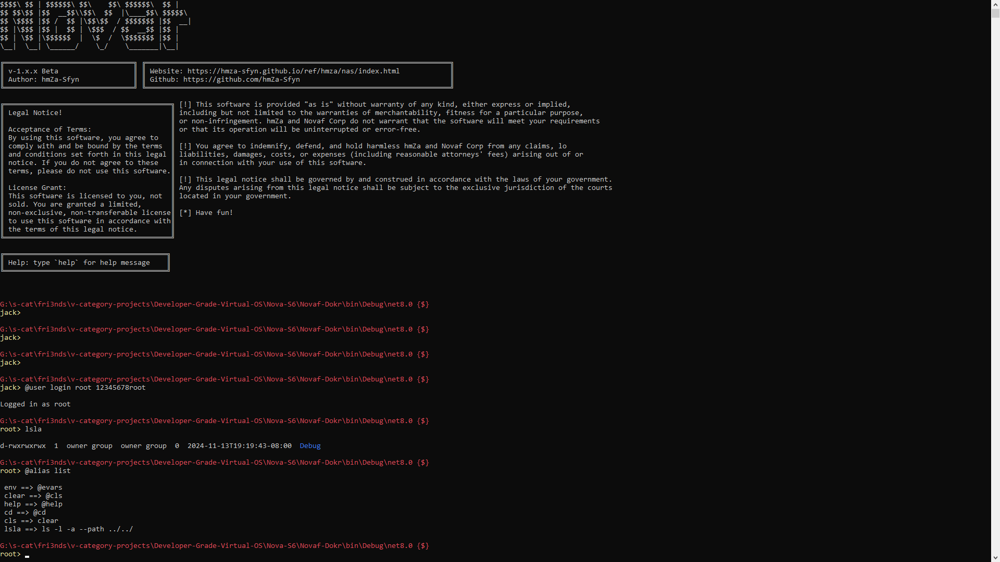
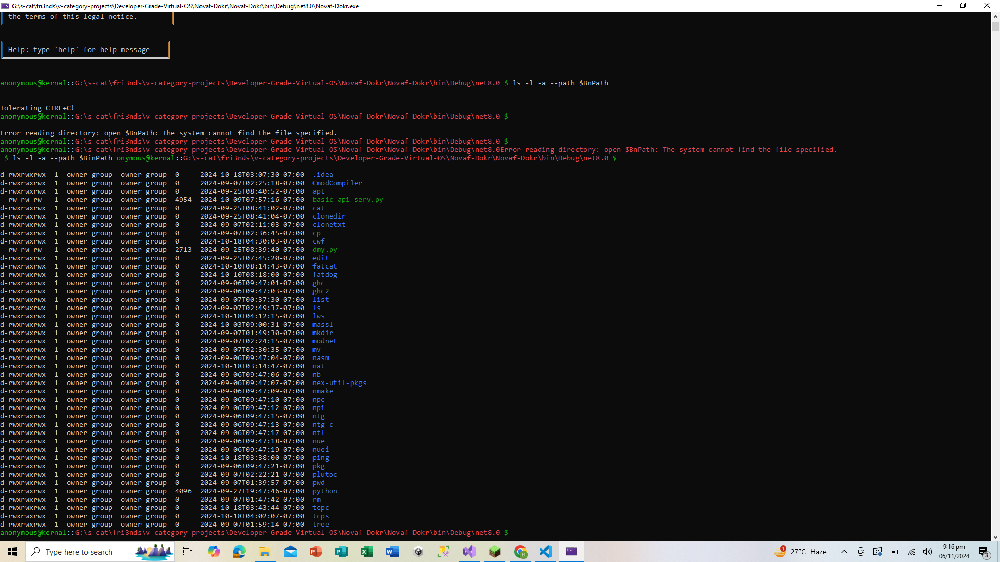

<br>
<br>

<h1 style="text-align:center;" align="center">Nova-S6</h1>
<h3 style="text-align:center;">Is A New Type Of Network Interface</h3>

<p style="text-align:center;">
    A <strong>custom network interface</strong> designed with unique
    protocols and procedures,
    tailored specifically to serve its own set of applications. Built 
    upon the powerful foundation of the <strong>Vin Virtual OS</strong>,
    this interface brings
    flexibility and control to modern network operations.
</p>


## Version 4.2.yz.24

**Added anathor shell** ```(hqsh)```

### Commands

# Command Documentation

## Basic Commands

### echo
Prints text to console without a new line.
```
echo Hello World
// Output: Hello World 
```

### echoln
Prints text to console with each argument on a new line.
```
echoln Hello World
// Output:
// Hello
// World
```

## Mind Storage Commands

### mind
Manages a list-based storage system.

#### Available Options:
- `-add`: Add items to storage
- `-get`: Retrieve item by index
- `-list`: Display all stored items

```
mind -add item1 item2 item3    // Adds items to storage
mind -get 1                    // Gets item at index 1
mind -list                     // Shows all stored items
```

## Register Commands

### reg
Manages key-value based storage.

#### Syntax:
```
reg>>set>>key>>value    // Sets a key-value pair
reg>>get>>key          // Gets value for a key
reg>>list             // Lists all registered key-value pairs
```

## Environment Variable Commands

### $$env
Manages environment variables.

#### Basic Usage:
```
$$env::variableName           // Gets value of specific variable
$$env>>variableName>>value   // Sets environment variable
$$env>>$all                  // Lists all environment variables
$$env>>$rem>>variableName   // Removes environment variable
```

# Complete Network Commands Documentation

## TCP Operations

### tcp-connect
Establishes TCP connection to a host and port
```
net tcp-connect hostname port [message]
net tcp-connect localhost 8080 "Hello Server"
```

### tcp-server
Creates a TCP server on specified port
```
net tcp-server port
net tcp-server 8080
```

## FTP Operations

### ftp-upload
Uploads a file to FTP server
```
net ftp-upload server username password localfile
net ftp-upload ftp.example.com user pass /path/to/file.txt
```

### ftp-download
Downloads a file from FTP server
```
net ftp-download server username password remotefile localfile
net ftp-download ftp.example.com user pass remote.txt local.txt
```

### ftp-list
Lists files on FTP server
```
net ftp-list server username password
net ftp-list ftp.example.com user pass
```

## Email Protocol Operations

### smtp-send
Sends email using SMTP
```
net smtp-send server port username password to subject body
net smtp-send smtp.gmail.com 587 user@gmail.com pass to@example.com "Test" "Message"
```

### imap-check
Checks IMAP mailbox status
```
net imap-check server port username password
net imap-check imap.gmail.com 993 user@gmail.com pass
```

## Security Protocols

### ssl-check
Validates SSL certificate of a host
```
net ssl-check hostname
net ssl-check example.com
```

### rdp-check
Checks if RDP port is accessible
```
net rdp-check hostname
net rdp-check remote-server.com
```

## Basic Network Commands

### ping
Tests connectivity to a host
```
net ping hostname
net ping google.com
```

### gethost
Gets host information
```
net gethost hostname
net gethost google.com
```

### getip
Resolves domain name to IP addresses
```
net getip hostname
net getip google.com
```

## Network Analysis

### scan-ports
Scans port range on host
```
net scan-ports hostname startPort endPort
net scan-ports 192.168.1.1 80 443
```

### traceroute
Traces route to destination
```
net traceroute hostname
net traceroute google.com
```

### whois
Performs WHOIS lookup
```
net whois domain
net whois google.com
```

## Network Monitoring

### listen
Creates network listener
```
net listen port
net listen 8080
```

### netstat
Shows active connections
```
net netstat
```

### check-connection
Verifies network connectivity
```
net check-connection
```

## Performance Testing

### bandwidth-test
Tests download speed
```
net bandwidth-test
```

## Web Operations

### download
Downloads file from URL
```
net download url localfile
net download https://example.com/file.txt local.txt
```

### http-get
Performs HTTP GET request
```
net http-get url
net http-get https://api.example.com
```

## Interface Information

### mac
Shows MAC addresses
```
net mac
```

### route
Displays routing information
```
net route
```

## UDP Operations

### send-packet
Sends UDP packet
```
net send-packet host port message
net send-packet 192.168.1.1 8080 "Hello"
```

## Best Practices

1. **Security Considerations**
   - Always use secure protocols when available (FTPS over FTP, HTTPS over HTTP)
   - Be cautious with credentials in command parameters
   - Use SSL/TLS for email protocols

2. **Performance**
   - Avoid running bandwidth tests frequently
   - Be mindful of port scanning ranges
   - Consider timeout values for network operations

3. **Error Handling**
   - All commands include error handling
   - Check return messages for operation status
   - Verify network connectivity before operations

4. **Usage Notes**
   - Commands are case-insensitive
   - Most commands require appropriate permissions
   - Some operations may be blocked by firewalls
   - For file operations, verify paths before execution

# Complete Network Commands Documentation

## TCP Operations

### tcp-connect
Establishes TCP connection to a host and port
```
net tcp-connect hostname port [message]
net tcp-connect localhost 8080 "Hello Server"
```

### tcp-server
Creates a TCP server on specified port
```
net tcp-server port
net tcp-server 8080
```

## FTP Operations

### ftp-upload
Uploads a file to FTP server
```
net ftp-upload server username password localfile
net ftp-upload ftp.example.com user pass /path/to/file.txt
```

### ftp-download
Downloads a file from FTP server
```
net ftp-download server username password remotefile localfile
net ftp-download ftp.example.com user pass remote.txt local.txt
```

### ftp-list
Lists files on FTP server
```
net ftp-list server username password
net ftp-list ftp.example.com user pass
```

## Email Protocol Operations

### smtp-send
Sends email using SMTP
```
net smtp-send server port username password to subject body
net smtp-send smtp.gmail.com 587 user@gmail.com pass to@example.com "Test" "Message"
```

### imap-check
Checks IMAP mailbox status
```
net imap-check server port username password
net imap-check imap.gmail.com 993 user@gmail.com pass
```

## Security Protocols

### ssl-check
Validates SSL certificate of a host
```
net ssl-check hostname
net ssl-check example.com
```

### rdp-check
Checks if RDP port is accessible
```
net rdp-check hostname
net rdp-check remote-server.com
```

## Basic Network Commands

### ping
Tests connectivity to a host
```
net ping hostname
net ping google.com
```

### gethost
Gets host information
```
net gethost hostname
net gethost google.com
```

### getip
Resolves domain name to IP addresses
```
net getip hostname
net getip google.com
```

## All Commands

```bash
net tcp-connect hostname port [message]      // Establishes TCP connection to a host and port
net tcp-server port                          // Creates a TCP server on the specified port
net smtp-send server port username password to subject body // Sends email using SMTP
net rdp-check hostname                       // Checks if RDP port is accessible
net ping hostname                            // Tests connectivity to a host
net gethost hostname                         // Gets host information
net getip hostname                           // Resolves domain name to IP address
net scan-ports hostname startPort endPort    // Scans port range on a host
net traceroute hostname                      // Traces route to a destination
net whois domain                             // Performs WHOIS lookup
net listen port                              // Creates a network listener
net netstat                                  // Shows active connections
net check-connection                         // Verifies network connectivity
net bandwidth-test                           // Tests download speed
net download url localfile                   // Downloads file from a URL
net http-get url                             // Performs HTTP GET request
net mac                                      // Displays MAC addresses
net route                                    // Shows routing information
net send-packet host port message            // Sends a UDP packet

```

## File Management Commands

### file
Comprehensive file management system.

#### Available Commands:
```
file create filename content    // Creates new file with content
file read filename             // Displays file content
file delete filename           // Deletes specified file
file append filename content   // Appends content to file
file rename oldname newname    // Renames file
file copy source destination   // Copies file
file info filename            // Shows file information
file exists filename          // Checks if file exists
file lines-count filename     // Counts lines in file
file search filename text     // Searches for text in file
file encrypt filename         // Encrypts file
file decrypt filename         // Decrypts file
file compress filename        // Compresses file
file decompress filename      // Decompresses file
file hash filename           // Generates SHA-256 hash
file watch filename          // Monitors file for changes
file temp [content]          // Creates temporary file
```

## Directory Management Commands

### dir
Directory manipulation commands.

#### Available Commands:
```
dir create dirname            // Creates new directory
dir list dirname             // Lists directory contents
dir delete dirname           // Deletes directory
dir rename oldname newname   // Renames directory
dir exists dirname           // Checks if directory exists
dir info dirname            // Shows directory information
dir size dirname            // Calculates directory size
dir count-files dirname     // Counts files in directory
dir count-dirs dirname      // Counts subdirectories
dir backup dirname          // Creates directory backup
dir clean dirname           // Removes all contents
dir find dirname pattern    // Finds files matching pattern
dir monitor dirname         // Monitors directory changes
```

## Help Command

### help
Displays available commands and their basic usage.
```
help
// Displays list of all commands and basic instructions
```

Note: All commands are case-insensitive for better usability.

## Version 2.0.0 (5/11/2024) Uploaded On (5~6/11/2024)

</img>

**Added some other scripting languages and other usefull tools, which makes it a complete standalone thing(terminal interface) :**
- Added anathor shell interface `hqsh`.
- Added shell builting functions `macros`. `!sh` , `!pwd`, etc...

**Other Advancements and Bug-Fixes:**
- Added a new style, (`type-zza`)
- Added custom assembly language.
- Added custom scripting language.
```go
                # Personal Finance Tracking Script

                # Initialize expense categories
                dict create categories
                dict set categories ""food"" 0
                dict set categories ""transport"" 0
                dict set categories ""entertainment"" 0
                dict set categories ""utilities"" 0

                # Income tracking
                var monthly_income 5000

                # Expense tracking function
                func add_expense category amount {
                    var current_expense dict get categories category
                    math add current_expense amount
                    dict set categories category current_expense
                    return current_expense
                }

                # Budget tracking function
                func check_budget {
                    var total_expenses 0
                    var food_expense dict get categories ""food""
                    var transport_expense dict get categories ""transport""
                    var entertainment_expense dict get categories ""entertainment""
                    var utilities_expense dict get categories ""utilities""

                    math add total_expenses food_expense
                    math add total_expenses transport_expense
                    math add total_expenses entertainment_expense
                    math add total_expenses utilities_expense

                    var remaining_budget monthly_income
                    math sub remaining_budget total_expenses

                    print ""Total Expenses:""
                    print total_expenses
                    print ""Remaining Budget:""
                    print remaining_budget

                    return remaining_budget
                }

                # Add some sample expenses
                call add_expense ""food"" 500
                call add_expense ""transport"" 200
                call add_expense ""entertainment"" 300
                call add_expense ""utilities"" 250

                # Check budget and expenses
                call check_budget
```

## Version 1.4.9 (5/11/2024) Uploaded On (5~6/11/2024)
<br>
<br>

</img>
**Added some system resource management commands:**
| Command                                                            | Description                                                                                                      | Imp |
|--------------------------------------------------------------------|------------------------------------------------------------------------------------------------------------------|-----|
| **@system0**                                                       | To manage system resources.                                                                                      |     |
| `@system /pointers /help`                                          | For this help message.                                                                                           |  Y  | 
| `@system /pointers :pointer/path`                                  | To access that pointer obj (not a string value or a path, just a obj).                                           |  N  |
| **Advanced:**                                                      |                                                                                                                  |     |
| `@system /pointers :pointer/path.function_or_arg($more_variables)` | To get that pointer obj and perform `function_or_arg($more_related_stuff)` with that obj.                        |  N  |
| `@system /pointers /list`                                          | To list all pointers with parent path. (`root/path`)                                                             |  N  |
| `@system /pointers /clear`                                         | To clear the pointer dict.                                                                                       |  N  |
| `@system /pointers /save $file/path`                               | To save current pointer dict to `$file/path`, which should be a `.pointers.vin` file.                            |  N  |
| `@system /pointers /save /nerv $file/path`                         | To save current pointer dict to `$file/path`, if `$file/path` does not exist, then just create one.              |  N  |
| `@system /pointers /load $file/path`                               | To load pointers from `$file/path`, which should be a `.pointers.vin` file.                                      |  N  |

> ## **Mission/Target** for version 1.4.9.x: `To make this to accept configuration files and more customization and resources management related stuff!`
> ## **Changes** made in 1.4.9.x: `Changed the input style, added` **CTRL+C** `control, and fixed @exit command, such that when you press CTRL+C it does not exit, when you type @exit, it does.`
                                   

## Version 1.1.0 (5/10/2024) Uploaded On (5~8/10/2024)

<br>
<br>

</img>
</img>

**Added some network and user commands:**

## **User Commands**

| Command                 | Description                                                                 | Imp |
|-------------------------|-----------------------------------------------------------------------------|-----|
| **@user**               | To manage users.                                                            |     |
| `@user list`            | To list all users.                                                          |  Y  |
| `@user add`             | To add a new user.                                                          |  Y  |
| `@user remove`          | To remove a user.                                                           |  Y  |
| `@user login`           | To login as a user.                                                         |  Y  |
| `@user logout`          | To logout from the current user and login as Guest.                         |  Y  |
| **More: (tier-2)**      |                                                                             |     |
| `@user name`            | To print the current username.                                              |  Y  | 
| `@user node-name`       | To print the current node name.                                             |  Y  |

### **Command Details**

1. **List Users**
   - **Command**: `@user list`
   - **Description**: Lists all the users currently in the system.
   - **Example**:
     ```bash
     @user list
     ```
   
2. **Add a User**
   - **Command**: `@user add <username> <password> <group>`
   - **Description**: Adds a new user with a username, password, and group.
   - **Example**:
     ```bash
     @user add john123 Passw0rd! guest
     ```
   - **Arguments**:
     - `<username>`: The username (3-20 characters)
     - `<password>`: The password (minimum 8 characters)
     - `<group>`: The user's group, e.g., `root`, `guest`, or `tmp`

3. **Remove a User**
   - **Command**: `@user remove <username>`
   - **Description**: Removes an existing user from the system.
   - **Example**:
     ```bash
     @user remove john123
     ```

4. **Login as a User**
   - **Command**: `@user login <username> <password>`
   - **Description**: Logs in with a specified username and password.
   - **Example**:
     ```bash
     @user login john123 Passw0rd!
     ```

5. **Logout**
   - **Command**: `@user logout`
   - **Description**: Logs out from the current user session and switches to Guest.
   - **Example**:
     ```bash
     @user logout
     ```

---

## **f-Net Commands**

| Command                 | Description                                                                 | Imp |
|-------------------------|-----------------------------------------------------------------------------|-----|
| **@fnet**               | To manage network nodes and systems.                                        |     |
| `@fnet list`            | To list all running nodes in your network.                                  |  Y  |
| `@fnet add`             | To add a new node in your system.                                           |  Y  |
| `@fnet remove`          | To remove a node from your system.                                          |  Y  |
| `@fnet login`           | To login to a node, either in your system or network.                      |  Y  |
| `@fnet logout`          | To logout from the current node and login to `127.0.0.1`.                   |  Y  |
| **More: (tier-2)**      |                                                                             |     |
| `@fnet node go-live`    | To publish a specific node or multiple nodes in your network.               |  Y  |
| `@fnet node shutdown`   | To shutdown a node in your network.                                         |  Y  |
| `@fnet node update`     | To update a node that you published or own.                                 |  Y  |
| `@fnet node stats`      | To view the stats of a specific node.                                       |  Y  |

### **Command Details**

1. **List Network Nodes**
   - **Command**: `@fnet list`
   - **Description**: Lists all running nodes in your network.
   - **Example**:
     ```bash
     @fnet list
     ```

2. **Add a Node**
   - **Command**: `@fnet add <nodename> <path> <port>`
   - **Description**: Adds a new node to your system with a name, path to its API script, and port.
   - **Example**:
     ```bash
     @fnet add node01 /api/script.py 5000
     ```
   - **Arguments**:
     - `<nodename>`: Name of the new node
     - `<path>`: Path to the Python Flask API script
     - `<port>`: Port number for the node

3. **Remove a Node**
   - **Command**: `@fnet remove <nodename>`
   - **Description**: Removes a node from your system.
   - **Example**:
     ```bash
     @fnet remove node01
     ```

4. **Login to a Node**
   - **Command**: `@fnet login <nodename> <username> <password>`
   - **Description**: Logs into a specific node in your system or network.
   - **Example**:
     ```bash
     @fnet login node01 admin Passw0rd!
     ```

5. **Logout from a Node**
   - **Command**: `@fnet logout`
   - **Description**: Logs out from the current node and switches to `127.0.0.1`.
   - **Example**:
     ```bash
     @fnet logout
     ```

6. **Publish a Node**
   - **Command**: `@fnet node go-live <nodename>`
   - **Description**: Publishes a specific node in your network.
   - **Example**:
     ```bash
     @fnet node go-live node01
     ```

7. **Shutdown a Node**
   - **Command**: `@fnet node shutdown <nodename>`
   - **Description**: Shuts down a specific node in your network.
   - **Example**:
     ```bash
     @fnet node shutdown node01
     ```

8. **Update a Node**
   - **Command**: `@fnet node update <nodename>`
   - **Description**: Updates a node you own or have published in your network.
   - **Example**:
     ```bash
     @fnet node update node01
     ```

9. **View Node Stats**
   - **Command**: `@fnet node stats <nodename>`
   - **Description**: Views the stats of a specific node.
   - **Example**:
     ```bash
     @fnet node stats node01
     ```

## **Request Commands (req)**

| Command                      | Description                                                                 | Imp |
|------------------------------|-----------------------------------------------------------------------------|-----|
| **@req**                     | To manage HTTP requests and interactions with URLs.                         |     |
| `@fnet req get`              | Perform a GET request to fetch data from the specified URL.                  |  Y  |
| `@fnet req post`             | Perform a POST request to send data to the specified URL.                    |  Y  |
| `@fnet req put`              | Perform a PUT request to update data at the specified URL.                   |  Y  |
| `@fnet req delete`           | Perform a DELETE request to remove resources at the specified URL.           |  Y  |
| `@fnet req list`             | List all possible paths available for requests.                             |  Y  |

### **Options**

- `--show-content` : Display the response content after the request is made.
- `--threads <number>` : Specify the number of concurrent requests to make.
- `--retry-on-fail <number>` : Set the number of retry attempts on failure.

### **Examples**

```bash
@fnet req get http://example.com
@fnet req post http://api.example.com/data --show-content
@fnet req get http://test.com --threads 5 --retry-on-fail 3
@fnet req put http://api.example.com/update --show-content
@fnet req delete http://api.example.com/resource/123
```


## Version 0.1.0 (5/10/2024) Uploaded On (5~8/10/2024)

- **Added some network and user commands:**
- Fixed bugs.
- Added functionality.


<br>
<br>

# What is `f-Net`? 🌐🚀

> **f-Net** is a cutting-edge network protocol designed by developers, for developers. It's still under construction, but once it's live, it's going to shake things up and rock the internet!  Stay tuned for a revolution in network technology! 🌟


## **f-Net Protocols**
| Protocol           | Description                                                                             | Imp |
|--------------------|-----------------------------------------------------------------------------------------|-----|
| `fri3ndly_network` | A simple friendly testing ground for fellow devs.                                       |  Y  |
| `ApiNet`           | A simple Api-Friendly network built for APIs.                                           |  n  |
| `StDtTr`           | A simple For-Media-Storage network built for fast data transfers.                       |  n  |
| `SecureXNet`       | A protocol for securing sensitive data in transit with high-level encryption.           |  n  |
| `CloudShareNet`    | Optimizes data exchanges across cloud platforms for syncing and collaboration.          |  n  |
| `GameStreamNet`    | A real-time data transmission protocol optimized for gaming and video streaming.        |  n  |
| `DeviceSyncNet`    | A protocol for syncing data across IoT devices with efficient command processing.       |  n  |
| `DataMeshNet`      | Decentralized data handling and storage protocol using mesh network concepts.           |  n  |

## **f-Net Modules**
| Module          | Description                                                                                | Imp |
|-----------------|--------------------------------------------------------------------------------------------|-----|
| `QoSControl`    | Manages Quality of Service to prioritize network traffic and ensure reliable performance.    |  n  |
| `CacheBoost`    | A caching mechanism to optimize data storage and retrieval, reducing repeated network calls. |  n  |
| `AutoScaleNet`  | Dynamically scales network resources based on traffic volume for efficient performance.      |  n  |
| `NetMonitor`    | Monitors network performance, logs errors, and sends alerts for performance and security.    |  n  |

# **Note:** 📢

> ## `The f-Net will is implemented in version 1.0` 🚀


# **Community Contribution Needed!** 🤝

> ## `I need your support` and contributions to make this project even better! `Your ideas, feedback, and help are invaluable to us`. Together, we can create something amazing! 🌟

# **Contribution Guidelines:** 📜

> ## `There are no limits to what you can publish!` Feel free to contribute anything that you think will be helpful to the project. Whether it's a penetration testing module, network interface configurations, or any other network-related enhancements, all `contributions are welcome!` 🚀
